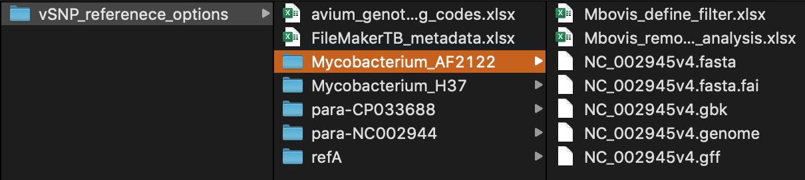
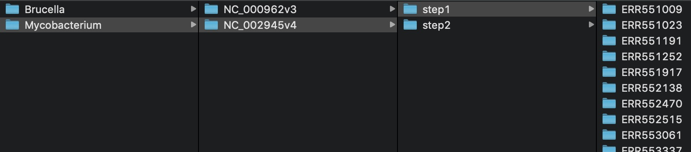
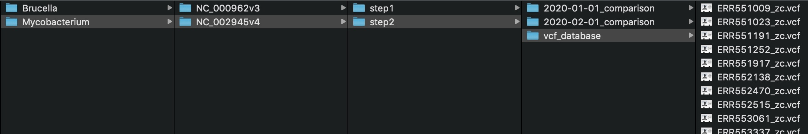

# Overview

## vSNP -- validate SNPs

### Whole genome sequencing for disease tracing and outbreak investigations is routinely required for high consequence diseases.  vSNP is an accreditation-friendly and robust tool, designed for easy error correction and SNP validation. vSNP rapidly generates annotated SNP tables and corresponding  phylogenetic trees that can be easily scaled for reporting purposes.   It is able to process large scale datasets, and efficiently accommodates multiple references.

### Features:

* Allows for the creation of customized groups utilizing user specified SNPs.
* Functionality to filter desired SNP positions by group or for all groups.
* Two types of output:
  1. A spreadsheet, or SNP table containing SNP calls sorted in evolutionary order with annotation and genome position information.
  2. Corresponding phylogenetic trees
* Ability for run-detail to be provided and optimized by multiple users.


vSNP is a 2-step process for efficiency.

1. `vSNP_step1.py` takes as input single or paired FASTQ files and either a reference FASTA or directory name containing the reference FASTA (see vsnp_path_adder.py below). For Mycobacterium tuberculosis complex and Brucella species, if no FASTA file or directory name is provided a "best reference" is automatically selected


   NOTE: It is only necessary to process each set of raw data once for each reference.  The VCF file from Step 1 is saved for future analyses with additional samples in Step 2.  It is recommended that VCF files generated with a single reference be placed in a single directory to facilitate future analysis. Only VCF files generated from the same reference can be compared in Step 2.
2. `vSNP_step2.py` builds SNP tables and corresponding phylogenetic trees from a directory containing a collection of zc.vcf files output from step 1. Step 2 will handle large datasets with thousands of VCF files, outputting detailed comparisons in minutes.


# Setup

### Installing vSNP:

It is expected the setup user is familiar with the command-line and can install conda.

Follow conda installation instructions:<br>
https://bioconda.github.io/user/install.html#set-up-channels<br>
Be sure to perform channel setup.<br>


Do not work in base.  If needed make new environmnet.

```bash
conda create --name myenv
```

Installation:

```bash
conda install vsnp
```

Run `vSNP_step1.py -h` to see usage details.

macOS users may need to follow these [special instructions for Samtools](./docs/macOS_special_instructions.md).

### Reference Options:

Except for a reference FASTA file, no other dependency file is required to run vSNP.  However, other files are recommended to add additional functionality to the script. For example, Excel file containing defining SNPs and filters will allow for the creation of custom subgroups.  A template is provided at `dependencies/template_defining_filter.xlsx`.

Download and add reference options. It is recommended that reference options be placed on storage accessible to both computing resources and subject matter experts analyzing the output data.

```bash
git clone https://github.com/USDA-VS/vSNP_reference_options.git
```

Use `vsnp_path_adder.py` to add options.  See `vsnp_path_adder.py -h` for help.

For example, after running the following all subdirectories are accessible using the `-r` option.  

```bash
vsnp_path_adder.py -d /full/path/to/vSNP_referenece_options
```




```bash
vSNP_step1.py -r1 *_R1*gz -r2 *_R2*gz -r Mycobacterium_AF2122
```

### Test Files:

Download test files:

```bash
git clone https://github.com/USDA-VS/fastq_data_set-tb_complex
```

Place each sample in its own directory, and on each directory run the following command:

```bash
vSNP_step1.py -r1 *_R1*gz -r2 *_R2*gz
```

See [help](./docs/run_guidance.md) running multiple samples at once.

Copy `*zc.vcf` output from step 1 into a directory for step 2. Only samples compared to the same reference can be analyzed together in step 2.<br>

Run `vSNP_step2.py` on this directory.

### Output Structure:

As with reference options, it is recommended to place output from step 1 and 2 on storage accessible to subject matter experts analyzing the data.  It may be necessary to use data from all three sources- reference options, step 1 and step 2 to fully understand the relationships of the data.

Recommended directory structure for step 1 and 2 output:





# Procedure Detail:
Procedure detail is [here](./docs/detailed_usage.md)

# Utility Scripts:

vSNP [utility scripts](./docs/utilities.md).

# Archived version:
https://github.com/USDA-VS/vSNP_archive/tree/master/vSNP_version1