# Procedures for whole genome SNP analysis using the vSNP tool

## Purpose/Scope

This document specifies the procedures for running the whole genome
single nucleotide polymorphism (SNP) analysis tool called vSNP.


## Equipment and Materials Required

To run vSNP

- Hardware: Computer with a minimum of 4 cores and 8 GB of memory with
  the following operating systems installed: MacOS, Linux, or Windows
  with the Ubuntu app installed.

- Software: vSNP is maintained at: <https://github.com/USDA-VS/vSNP>

- Software: Reference option files can be download at:
  https://github.com/USDA-VS/vSNP\_reference\_options.git.

To analyze vSNP output

- Program for viewing Newick tree files such as FigTree
  (<http://tree.bio.ed.ac.uk/software/figtree/> ), Genieous
  (<https://www.geneious.com/> ) or equivalent.

- Program for viewing BAM and vcf files such as Integrated Genomics
  Viewer (IGV) (<http://software.broadinstitute.org/software/igv/> )
  or equivalent.

- Program for editing VCF files such as Microsoft Excel or equivalent.

## Procedure

# Installation of Code

- vSNP is installed following the instructions at: <https://github.com/USDA-VS/vSNP> .The repository records changes for both vSNP scripts and installation instructions.

- Local copies of reference option files are maintained and pushed to this
  repository when updates are made: Reference option files necessary to run vSNP are maintained at
  https://github.com/USDA-VS/vSNP\_reference\_options.git

- To ensure vSNP reproducibility, test files are available at: [USDA-VS's Github page](https://github.com/USDA-VS). There are two repositories for testing step 1. A repository that includes [*Mycobacterium bovis* FASTQ files](https://github.com/USDA-VS/fastq_data_set-tb_complex) and a repository containing [*Brucella suis* biovar 1 test files](https://github.com/USDA-VS/fastq_data_set-brucella). For step 2 testing a [repository of VCF files](https://github.com/USDA-VS/vcf_test_files) against different references is available.

# Update Code Repository

- vSNP can be updated using the Anaconda installation package.
- File shown using `vsnp_path_adder.py -s` will be erased on update.  Either save file prior to updating or use `vsnp_path_adder.py -d` to re-establish paths after updating.

# Reference Options

- Reference options can be grouped and accessed via named directories. New directories are added using, `vsnp_path_adder.py` (installed with vSNP). In vSNP\'s installed package, reference option paths are stored in \"reference_options_paths.txt". Directory/reference options are shown using -t option.

- Seven files can be included:

  - Excel: (see template\_define\_filter.xlsx) with defining SNPs
    and filter positions. \<Required for grouping\>

  - Excel: metadata.xlsx 3 column file: VCF file name, updated file
    name, representative (optional boolean). File name must contain
    \"meta\" somewhere in its name. \<Optional\>

  - Excel: remove\_from\_analysis.xlsx 1 column file: removes files
    based on name minus .vcf extension. File name must contain
    \"remove\" somewhere in its name. \<Optional\>

  - FASTA (.fasta): used by vSNP\_step1.py as reference. \<Required,
    unless explicitly given with -r option\>

  - GBK (.gbk): used to annotate VCF files and tables. \<Optional\>

  - GFF (.gff): used by IGV to show annotation. \<Optional\>

  - IGV file: .genome IGV file mapping FASTA and GFF. \<Optional\>

- Ready-to-use vSNP reference option files for different reference
  options can be cloned from here:
  https://github.com/USDA-VS/vSNP\_reference\_options.git. The cloned
  repository can be added with `vsnp_path_adder.py -d`.

# vSNP Step 1 -- Command-line

## Input Data

- Step 1 is called on a working directory containing zipped FASTQ using one of the three senario options:
  
  1) Provide a FASTA
  ```bash
  vSNP_step1.py -r1 *_R1*fastq.gz -r2 *_R2*fastq.gz -r *fasta
  vSNP_step1.py -r1 *fastq.gz -r *fasta
  ```

  2) Provide a Reference Option
  ```bash
  Run -t option to see table of reference options: vSNP_step1.py -t
  vSNP_step1.py -r1 *_R1*fastq.gz -r2 *_R2*fastq.gz -r Mycobacterium_AF2122
  ```

  3) Find Best Reference (only for TB complex, paraTB, and Brucella)<br>
  Run without -r option
  ```bash
  vSNP_step1.py -r1 *_R1*fastq.gz -r2 *_R2*fastq.gz
  ```

## Run vSNP_step1.py

Step 1 Options: `vSNP_step1.py` can be ran with options, the available
options depend on which step is being ran. Use the `-h` option to see
basic usage, available options and their descriptions.

- Options important for understanding step 1 are:

  - `-r1`, Required: single read or R1 when Illumina paired reads
    used.

  - `-r2`, Optional: R2 Illumina reads.

  - `-r`, Optional: Provide reference option or FASTA file. If neither
    are given, no -r option, then a TB/Brucella/paraTB best
    reference is searched.

  - `-t`, See reference options.

- Sample FASTQ files need to be separated into individual directories.
  Reference organisms may need to be specified using `-r` option.

  - When vSNP is called without -r option it will try to determine a
    reference genome to use. If a specific reference (TB/Brucella/paraTB) is found it
    aligns to the determined reference.

  - A reference can also be specified.  See table of reference names using -t option.

  ```bash
  vSNP.py -r1 *_R1*gz -r2 *_R2*gz --r <reference name>
  ```

  - FASTA can explicitly be given to -r option.

  ```bash
  vSNP.py -r1 *_R1*gz -r2 *_R2*gz -r /path/to/reference.fasta
  ```

### Failures & Errors

 Output of the script should be evaluated for completeness and failures. There are multiple potential causes for failures during Step 1. It is the bioinformaticist's responsibility to determine why a sample failed to identify a reference to align against and also to determine if Kraken or another program should be utilized to better characterize the sample. The bioinformaticist should determine if the other outputs are reasonable, however; it is the validator, or SME's responsibility to check the accuracy of the output. See below.

- Sample statistics (sample\_name)\_(Date/time).xlsx
  - The data in this file is summarized for quick and easy review of
  the output of step 1.
  - Common errors and issues that can be determined from the
  statistics
  - Reference not found
  - Insufficient:
  - FASTQ file size
    - Q30 values
    - Mapped reads
    - Genome coverage
    - Average depth of coverage
    - Read length
  - Excessive:
    - Number of Unmapped reads
    - Unmapped assembled contigs
  - Unexpected number (to low or too high) of Good SNP counts
  - Failure to generate Brucella MLST, Spoligotype (octal,
    hexadecimal, and binary codes) for MTBC (Mycobacterium
    Tuberculosis Complex), and SB Code (Spoligotype for *M.
    bovis* found at <https://www.mbovis.org/> )

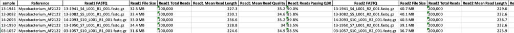
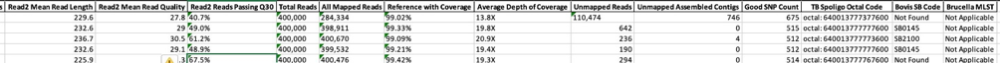
Example of combined sample statistic output

*Reference not found* error
  - If the script returned with no reference found the
  best\_reference.txt file should be examined.
  - Check the file(s) for signs of a poor sample. (See below)
  - Reference may need to be determined by another method such as Kraken
  or wet lab techniques.
  - If the reference can be determined by another method, use -r option
  with appropriate reference designation to process the files through
  step 1. (See 5.3.2 for species information)

*Small file size*
  - Smaller than expected file size can be an indicator that an
insufficient quantity of DNA was sequenced.

*Low depth of coverage*
  - Samples with low depth of coverage should be analyzed in step 2 with
extreme caution, especially those with less than 20X coverage. The
alignment will likely have regions of little or no coverage causing
unreliable SNP calls.

*Contaminated sample*

- Contaminated samples may suffer from 1 or more of the above points.
  If it is suspected that a sample is contaminated, then
  identification should be performed. For example, this can be done
  using read identification software or de novo assembly and Blast.
- Reads may be sufficiently cleaned up with read identification
  software like Kraken where contaminating reads can be identified and
  removed. This should be done with caution until the method of read
  removal has been validated as removing reads may result in bias
  and/or low depth of coverage. (See *Low depth of coverage*)

# vSNP Step 2 -- Command-line

### Input Data

- `vSNP_step2.py` is called on a working directory containing Variant
  Call Format (VCF) files.
- All VCF files must be based on alignments to the same version of the
  same reference. The reference name (e.g., NC\_002945.4) can be found
  in the VCF file header.
- Use `-h` option to see available options and their descriptions:
- Options important when understanding step 2:

  - `-a` create a table with all isolates
  - `-s` create a table with a subset of samples
  - `-d` turn off concurrence for troubleshooting
  - `-n` do not apply position filtering
  - `-f` find possible positions to filter
  - `-t` show reference types available

### Failures & Errors

- Output should be examined for completeness and failures. Each
  unzipped subdirectory in the output should contain sorted
  table and cascading table, the aligned fasta file used to generate
  the phylogenetic tree, and the phylogenetic tree file.
- Phylogenetic trees should be generated and tables should be
  populated. These files may generate, but may not be properly
  populated if errors occurred during the analysis or fewer than 3 VCF
  files were placed into a single group. The sorted table should
  appear in numerical position order, while the organized table groups
  SNPs and isolates together to most closely represent evolutionary
  patterns.
- Software versions used for the analysis are provided in the output.
  Unexpected changes can occur when pieces of software are updated (however uncommon).
  The versions of all software used in the analysis are listed for
  comparison and verification.
- If VCF file(s) became corrupted:
  - Check that VCF header format is correct.
  - Scan file for obvious VCF deformities.
  - If unable to find corruption run individual file using a Python
    interpreter with a package such as Python's package "vcf" to
    find the exact position of corruption.
  - Check if same reference or same version of the reference was not
    used to generate all VCF files.

# Output Analysis and Reporting

## Output File Structure

- **Step 1** generates a folder containing files and
  subfolders that are named using the isolate identification listed on
  the original FASTQ file. List of contents are as follows:

  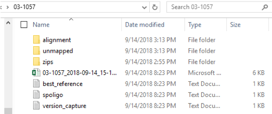<br>
  Step 1 output structure

  - Excel file containing quality metrics. This file is labeled with the isolate name and the analysis date.
  - best_reference: this file documents the bacterial species oligo results that determined the best reference.
  - spoligo: for Mycobacterium tuberculosis complex isolates. This file lists the read counts for each of the spacer regions.
  - version_capture: identifies the version numbers for the associated software used in Step 1.
  - zips folder: contains a copy of the FASTQ files for this isolate.
  - unmapped folder: vontains a FASTA file of reads from each FASTQ file that did not align to the reference. This folder also contains a file called unmapped_contigs which is an assembled FASTA file of the unmapped reads.
  - alignment folder: folder contains several files of importance including VCF files, a BAM file and the reference FASTA.

  - Alignment folder contents
  
    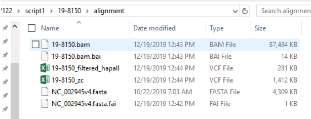<br> 

    - `zc.vcf` Lists only SNPs calls and loci that did not have any coverage (zc = zero coverage). This is the vcf that is transferred to Step 2 for analysis.
    - `hapall` this file includes all the variants identified by the haplotype caller. This is the file of preference to view in IGV when validating SNPs.
    - `bam` the bam file used in IGV for SNP validation.
    - `FASTA` file of the reference used.

- **Step 2** generates SNP tables and phylogenetic trees
  for each group or subgroup.

  - All\_VCFs is an option that creates a phylogenetic tree and SNP tables for all sequences in the comparison. Depending on the genetic distance and number of sequences, this option may or may not be practical to execute.

  - Each group and subgroup will have its own file comparing only those isolates within that group.
  
    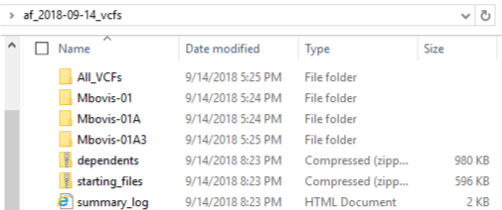<br>
    Step 2 output


  - Two zipped folders (`dependents`, `starting files`), contain copies of the initiating vcf files and user defined dependents need for traceability and troubleshooting purposes. They are not needed for any analysis.

  - `summary_log` this is an important file. It is a summary of Step 2 output. It lists any sequences that may be mixed, provides the group location of each sequence, and provides information on any corrupt VCF files as well as software version numbers. Use this file to identify the group and file location of any isolate in the database aligned to the particular reference.

  - File structure within a group folder: each group will contain a subfolder that has a standard naming convention. Each file within that group will have the group name, date and time stamp of the run, and then the type of file.
  
    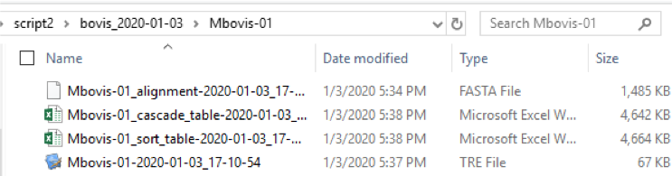<br>
    Group folder contents

    - `FASTA` file is an aligned fasta file for all isolates in the group. This FASTA file (and all files within this folder) contains only SNP calls that are parsimoniously informative within the group. [ ]{.underline}
    - `cascade_table` A formatted Excel table that groups and sorts isolates and SNPs according to relatedness.
    - `sort-table` A formatted Excel table that keeps the SNPs in numerical order. This file may be useful in determining a genomic region that is unreliable.
    - If table size exceeds Excel column limit data sets are split into multiple tables. This happens when isolates within the group are highly diverse.
    - `RAxML-bestTree` provided as .tre file (for viewing and formatting) in a phylogenetic tree program.

## Reference option files
 Each reference can use a set of dependency files. They must be located in a folder accessible to the analyst. 

- The analyst may need to make corrections and adjustments during the
  validation procedure to the `define_filter`.

  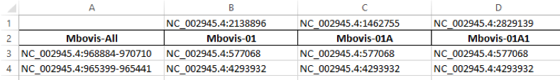<br>
  defining_filter.xlsx content example

  - `define_filter` excel file is important. It contains the defining SNPs in row \#1 and the name of the group in row \#2. This SNP position will be used to query all of the VCF files and all isolates containing a call at this position will be pulled into the group and will end up in a folder with the group name. It does not matter if the SNP call at that position is an AC=1 or AC=2, nor the actual nucleotide call. Groups can be added as needed by adding columns to this table. Analysts can select new defining SNPs (absolute position containing `chrom:position`) by using the SNP table of a larger group and selecting robust calls that have a good depth of coverage and preferably a perfect mapping score. Starting in Row \#3 are the positions that need to be filtered for that particular group. Important note Column 1 does not have a defining SNP listed. The filters listed in this group (named containing "All") will have those positions removed for all of the groups. The filters listed in the groups with a defining SNP, starting in column B will only be included in the particular group they are listed under. This means that each group with a defining SNP will have all of the filters applied in column A and then the particular group filters as well. This is useful in lineages where there is a particular problem resolving a position (such routinely occurs at a deletion site) but does not occur in other branches.
  - `RemoveFromAnalysis`: This file allows VCF files to be removed from the analysis, but not from the source folder allowing for more individualized analyses as needed.
  - `FASTA` reference
  - `GBK` annotate tables
  - `GFF` provide annotation in IGV
  - `genome` The genome file is used in IGV as the reference. If it is not already built, it can be created with the FASTA and the GFF file contained within this folder. Note: the GBK annotation file will not work for IGV.

## Evaluating Step 1 Quality Metrics
 In order to properly analyze WGS sequencing results it is critical to first evaluate the performance of the sequencing run, and in particular the performance metrics of each sequence. There is no "lower limit" of sequence quality that prevents analysis across the board, especially if the sequence was difficult to obtain. However, interpretation must be done in context with the sequence quality.

- **Stats file** This file is contained within each isolate folder in Step 1, it should be reviewed by the bioinformaticist and SME. While the importance of each column's results may vary depending on the biology of the organism, a few critical metrics are identified below:
  - Read 1, Read 2 size: zipped file size of the reads. Typically for a 5MB genome, each file size increase of 10MB (in total) should increase the depth of coverage by 5X. vSNP was optimized for a sequencing depth of coverage of 80X-150X, but can be used at much lower and higher coverage depths as needed.
  - Average Depth of Coverage: Depth of coverage.
  - Reference with Coverage: The percent of the reference covered by the sequence. This metric is highly dependent on the bacterial species. For clonal organisms, coverage below 99% will likely require a significant amount of manual correction.
  - Unmapped_Assembled_Contigs: The number of contigs not mapping to the reference. This metric is highly dependent on the bacterial species, however for clonal organisms such as Brucella, MTBC, and paratuberculosis it can be a fairly accurate estimate of the level of contamination within the sequence. Highly contaminated isolates are of concern for two reasons, first the depth of coverage will be lower than expected, but more importantly, if the contaminating organism is closely related to the organisms of interests (such as an *M. avium* isolate contaminating an *M. tuberculosis* isolate) erroneous SNP calls may result, especially in highly conserved regions of the genome. Pay careful attention to these sequences during validation and if needed, the reads can be isolated using a tool such as Kraken and reran through the pipeline.
  - Good_Snp_Count: The number of SNPs with a QUAL score of \>300 that are AC=2 from the reference. For efficiency it is ideal to have the reference within 1000 SNPs of the isolate. The accuracy of this number is highly dependent on depth of coverage.
  - Brucella MLST: Based on https://bmcmicrobiol.biomedcentral.com/articles/10.1186/1471-2180-7-34.
  - TB Spoligo Octal Code: For MTBC only. In order for this to be accurate, coverage should be between 30X - 500X. All unexpected spoligotypes calls and isolates falling outside the 30X - 500X parameter should be verified.

- **Evaluating the "best reference" chosen**

  - best_reference.txt: vSNP's "best_reference" function supplies a dictionary of named short sequences, that based on presence or absence of sequence, can determine a "best reference" to align reads against. The example below shows the expected outcome from short sequence counts against the raw FASTQ files of a B. abortus biovar 1 species. There are only short sequence matches against Brucella and the absence of sequence "01_ab1" indicating biovar 1. If a reference is unexpectedtly missed or found the short sequence counts within this file can be examined. Some possible situations of unexpected results are contamination, crosstalk between samples, or a sample where a reference is unavailable via the "best_reference" function.

    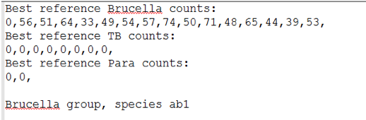<br>
    best_reference.txt content example

- **Evaluating the accuracy of the spoligotype calls**

  - spoligo.txt -- vSNP's "spoligo" fuction outputs counts of each spacer sequence against the raw FASTQ files and the octal code based on those counts. As with best\_reference.txt this file is available for examination.
  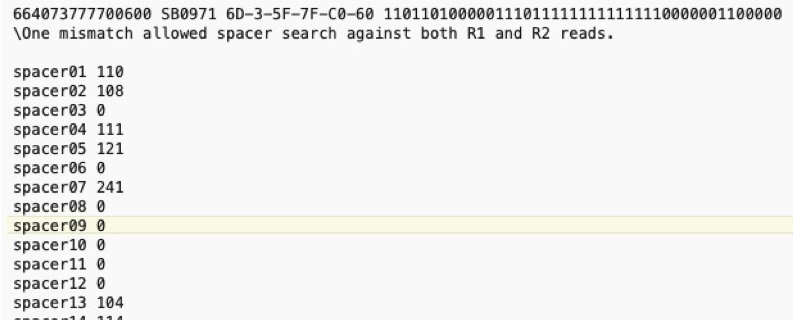<br>
  spoligo.txt contents example

- Investigate unexpected octal codes by evaluating the Spoligo file contained within Step 1 output. In order to call a spacer region, the program requires at least 5X coverage, and will allow for one SNP mismatch within the spacer region. Low coverage isolates may not reach the 5X threshold and will need to be corrected. Furthermore, very high coverage isolates (\>500X) may have greater than 5 reads that have been miscalled due to barcoding crosstalk.

- **Evaluating contamination**

  - Occasionally there may be a need to look at the unmapped contigs more in depth. The bioinformaticist can run Kraken on the sample for a thorough evaluation, but it is also possible to manually blast the unmapped contigs. This can be done using the unmapped contig file located in Step 1 and using NCBI's BLAST engine.

## Evaluating Step 2 Output

 When step 2 is ran a summary file is saved in the analyses' working directory. It provides information important for evaluating the run and finding samples. The following information is summarized:

- Variable (reference option) type used when running analysis.
- Number of VCF files ran in start of run.
- Number of VCF files kept for analysis.
- Run time -- longer than expected run times can be an indication of a poor VCF file in the analysis or large groups that should be split.
- List of corrupt VCF files removed from the analysis. If vSNP_step2.py encounters a VCF file that cannot be parsed it will delete the file from the analysis and report the removed file.
- Each isolate ran in the analysis is listed along with the group or groups it has been placed.
- All samples with defining SNPs with an AC=1 call indicating a mixed isolate are marked as mixed. Defining SNPs are chosen because they are of high quality and group related isolates with confidence. If an ambiguous call is made for a defining SNP it is a strong indicator of a mixed isolate.
- All samples that do not contain a defining SNP are marked as not having a defining SNP.
- Program versions

## Validating and correcting SNP calls
 For disease traceability, decisions on sequence relatedness can made when sequences are 0-3 SNPS from each other vs. \>5 SNPs. Therefore the analysis pipeline must be highly accurate. Despite the many improvements in algorithms for alignment and SNP calling software, erroneous calls cannot be fully eliminated and manual validation must be performed. These are done by using the SNP table generated in Step 2, a genome browser such as IGV, and a phylogenetic tree viewer such as FigTree.
The general principles are:
1) view the SNPs within their evolutionary context
2) identify likely erroneous calls
3) verify SNPs with limited evidence that significantly alter evolutionary relationships
4) permanently correct erroneous SNPs within the Step 2 source files
5) rerun Step 2 if needed
6) verify the corrections have been made, and finally
7) ensure the phylogenetic tree reflects the SNP table exactly.

- **Structure of the SNP table**
 The SNP table is critically important for reporting closely related isolates. The information contained within the SNP table allows for nearly complete transparency and allows for the replication of results. Furthermore, it is an efficient way to identify mixed SNPs when multiple strains are infecting an animal.  The figure to the right details the SNP table structure. The columns identify the genome location of the SNP calls, and the isolates are listed in the rows. The reference, or ancestral strain (as long as the reference is an outgroup) is listed across the top and is identified as the "reference call". All SNPs are highlighted, any SNPs that are not highlighted will match the reference. Map-quality is an average of the map quality scores of each isolate at that position. A score of 60 is the highest possible. The lower the score the lower the confidence that the read has been mapped to the correct location on the genome and consequently the less confidence that the SNP was called correctly. Finally the annotation of the position is listed at the bottom of the SNP table.

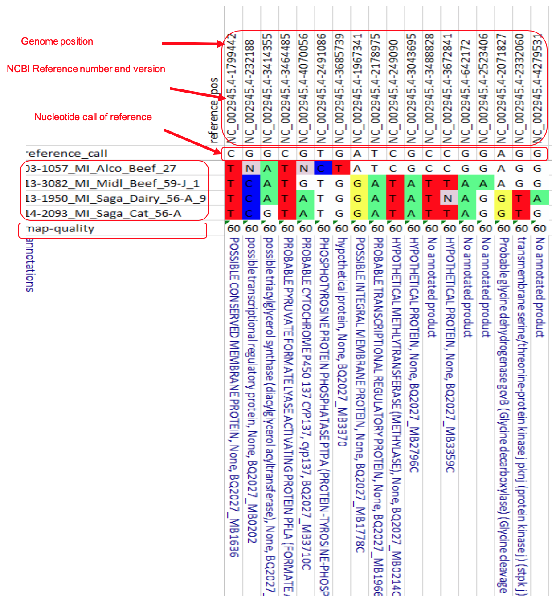<br>
table description

- **Evaluating SNPs within their evolutionary relationships**

  - The script automatically attempts to sort the SNPs according to their evolutionary age within the SNP table. The oldest SNPs (encompassing the most isolates) will be furthest to the left. This sorting is somewhat crude. SNPs can be manually moved around as long as entire columns or rows are selected for the move. This will not change evolutionary relationships. Sorting is done to improve readability or to better match a related tree.
  - Isolates that contain mixed calls at a SNP position are coded by the International Union of Applied and Pure Chemistry (IUAPC) ambiguous calls. This is done by telling the SNP caller (Freebayes) that the organism is a diploid. SNP positions that have a consensus variant call (typically \>90%) are considered homozygous and the variant SNP is identified as "pure". The program considers the variant is located on both alleles, and designates this as an Allele Count of 2 (AC=2). Variant calls that are mixed are considered heterozygous (typically \<90%) and are designated AC=1. vSNP then converts all AC=1 to their ambiguous code within the SNP table as long as there is a closely related isolate in the SNP table that has an AC=2 at that position. True mixed calls will have all evolutionarily younger SNPs showing up as mixed as well unless the % of the mixture is at or near the cutoff for the algorithm which is around 10%.

- Identifying erroneous calls.

  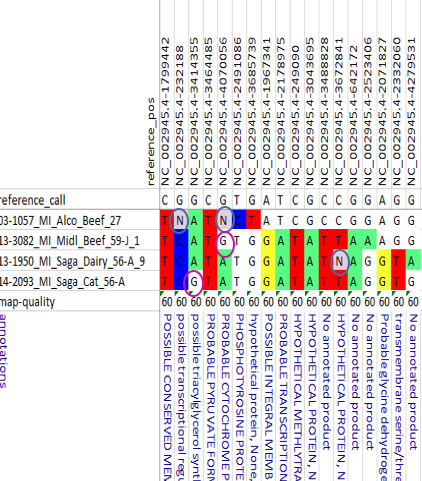<br>
  Call errors

  - SNP mutations are rare in bacterial species (typically around 1 mutation per 1 billion replications) Therefore, homoplasy, and SNP reversion to the ancestral call should be rare. All positions exhibiting these behaviors should be evaluated.

  - The positions circled in blue are being identified as variants, but their QUAL score is not high enough to be called automatically. This cutoff is determined by the SME's and may vary by organism. These calls need to be verified and corrected.

  - The positions circled in pink have not been called, and based on their evolutionary relationships, they should have been. These positions should be evaluated in the genome browser and corrected as appropriate.

- Confirming critical SNPs, or SNPs that meaningfully alter evolutionary relationships

  - An understanding of the disease, historical outbreaks, and current epidemiology of the case is helpful during the manual SNP validation process. If there is only a single SNP that is significantly altering the evolutionary relationship of the isolates (such as one SNP tying isolates from 2 farms together), those SNPs should be manually verified. It is important to take into account the Map quality, the annotation, depth of coverage and calls at that position among closely related isolates.

- Permanently correcting errors.

  - All erroneous calls should be permanently corrected by altering the vcf file within the source folder and making a notation within the vcf file that a change was made. [Do not]{.underline} alter vcf files located in the data files generated by step 1 of the process and subsequently used by IGV to verify SNPs. It is important to use the original file to verify the calls in IGV. Alterations to the VCF files should be made on a copy that has been transferred to a source file used to initiate step 2. If opening up the vcf files with Excel (recommended) the notations should be made in column M of the vcf. Recommended wording examples:

    - Increase Qual score to 301, Initials, date corrected.

    - Changed to AC=2 1, Initials, date corrected.

    - Added to vcf, Initials, date corrected.

  - Occasionally an erroneous SNP call is made because the position within the genome is problematic. Examples include near a deletion event, within repeat regions, reads mapping to multiple areas of the genome, etc. When the position is not reliable across multiple isolates, the position itself should be added to the filter file which is located in the vSNP reference option folder rather than corrected within each vcf file. In general, it is best to filter the position as finely as possible. For example if the position is problematic across all phylogenetic groups then it should be included under the vcf\_all (typically Column A -- See Reference option files on Page 8). Otherwise limit filtering to the groups where the calls are problematic.

- Verifying corrections and validating the phylogenetic tree.

  - The phylogenetic tree should reflect the SNP table exactly with the exception of mixed isolates. Therefore, it is critical to rerun Step 2 once permanent changes have been made to the VCF files or the filter files.

  - Evaluate the phylogenetic tree and ensure the length of the branches properly reflect the number of SNPs in the SNP table and each node in the phylogenetic tree can be identified within the SNP table.

## Adding or updating metatags

 It is important to enter the **p**ermanent unique isolate number correctly on the sequencing instrument as that number will carry through and link all the files together back to the original "raw" files. vSNP\_step2.py can add metadata to the isolate number provided an Excel file (Excel file must have \"meta\" in its file name) in the reference option folder that contains the sample name (all characters left of the first underscore or period) in the first column and the metadata name in the second column. The sample name and metadata name cannot have underscores, spaces or periods within the number itself, but other characters such as dashes are acceptable.

- MTBC metadata is maintained within the FileMaker database and Exported to Excel.
- All other bacteria have the metadata managed using Excel worksheets
- Each disease program will have different policies on what metadata should be used. Typically host species, country and possibly animal location state are used. Owner names, official IDs, and animal names must not be used.

## Adding new groups or subgroups

 Defining SNPs are used to create and identify new groups. Creating new groups or subgroups can be useful when groups become large and unwieldy.

- In order to generate a proper SNP table and tree, there must be at least 3 isolates with the new group.
- Using the SNP table containing isolates from the next largest group, identify candidate defining SNPs that contain the subgroup of isolates. Use IGV, Map-quality scores, QUAL scores, and SNP location (annotation) to determine the best candidate.
- Enter the absolute number (chrom:SNP position) in the top row and group designation below it in the defining\_filter.xlsx spreadsheet in the reference option folder. (See Reference option files on Page 8.)
- In the defining\_filter.xlsx the -All column is special in that these positions are applied to all groups and subgroups.
- Group filter do not apply to subgroups, so for subgroups, copy relevant filtered SNPs in the filter folder. For example, if the new group is a subgroup of a larger group, copy the positions of the larger group into the new group.

## Removing isolates from the analysis

 Occasionally there is a need to remove an isolate or isolates from the analysis. Reasons may include proficiency test samples, duplicates, and mixed strains. There are 2 methods to remove files:

- Permanently delete the VCF file from the source folder used in Step 2. Use this method when there will not be a need to reevaluate a particular sample. Please note: DO NOT remove or delete data files generated in Step1. Unwanted files should be archived according to data retention polices.
- Add the VCF file name to the remove_from_analysis spreadsheet located in the reference option folder. The advantages to using this method are: the changes made to the VCF during the validation process are retained. The VCF can easily be added back to the analysis by removing the name from the list.

# Expected results from test data

- To ensure vSNP reproducibility three repositories are available with test files at [USDA-VS's Github page](https://github.com/USDA-VS). There are two repositories for testing step 1. A repository that includes [*Mycobacterium bovis* FASTQ files](https://github.com/USDA-VS/fastq_data_set-tb_complex) and a repository containing [*Brucella suis* biovar 1 test files](https://github.com/USDA-VS/fastq_data_set-brucella). For step 2 testing a [repository of VCF files](https://github.com/USDA-VS/vcf_test_files) against different references is available.
- For repositories containing FASTQ files, each FASTQ has been cut to 200,000 reads per file. This has been done to make transfer of files faster. Full size files are available in SRA.
- Measured parameters shown in the Excel stats file may not be exact but should show similar values.
- SNP alignment tables should report SNP at the same positions shown.

## fastq\_data\_set-tb\_complex repository:

<br>

- All files should align to reference genome AF2122. Note possible contamination in sample 13-1941. Reads mapping to the reference genome, genome coverage and average depth of coverage are all lower. Also, unmapped contig count is high. Even though all these files are closely related the "good snp count" is higher. Octal codes are cross reference against the mbovis.org database. Note there are no SB codes found for 03-1057 and 13-1941, and 14-2093 has an unexpected SB code. This is likely due to the lower coverage of these samples, which is causing a positive spacer to be misidentified. A perfect situation to investigate the spoligo.txt file.

## fastq\_data\_set-brucella repository:
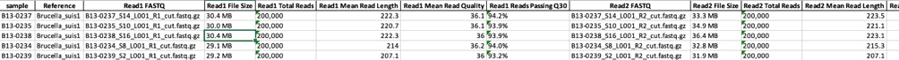
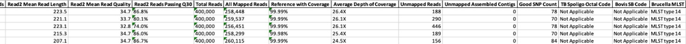<br>

- All files should align to reference genome for *B. suis* biovar 1. Measured parameters are similar for all samples, which are closely related and have the same read count in each FASTQ.

## vcf\_test\_files:

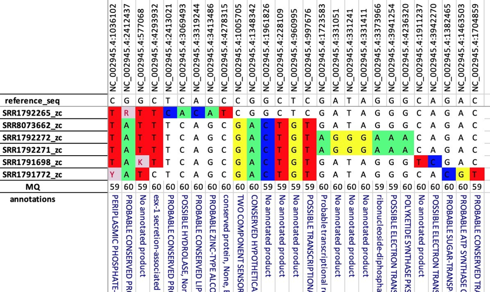<br>
*M. bovis* -- AF2122 reference

- Expected to complete as Mbovis-01 group with 4 samples and 17 positions. In the organized table as shown above SNP differences should cascade and most closely represent evolutionary patterns. Vertical order of samples and horizontal order of positions may vary. Sample names are subject to metatags provided

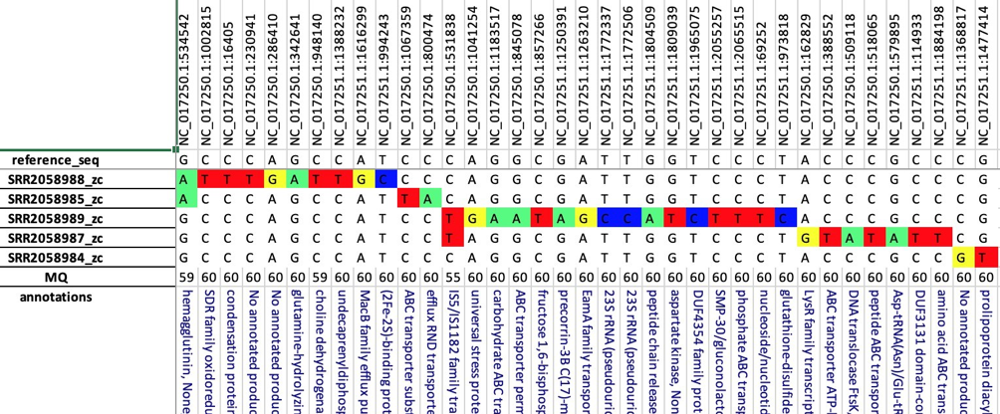<br>
*B. suis* biovar 1 - 1330

- Table is expected to complete as Bsuis1-09 with 5 samples and 37 positions.

# Comment
Post issues https://github.com/USDA-VS/vSNP/issues or ask questions tod.p.stuber@usda.gov